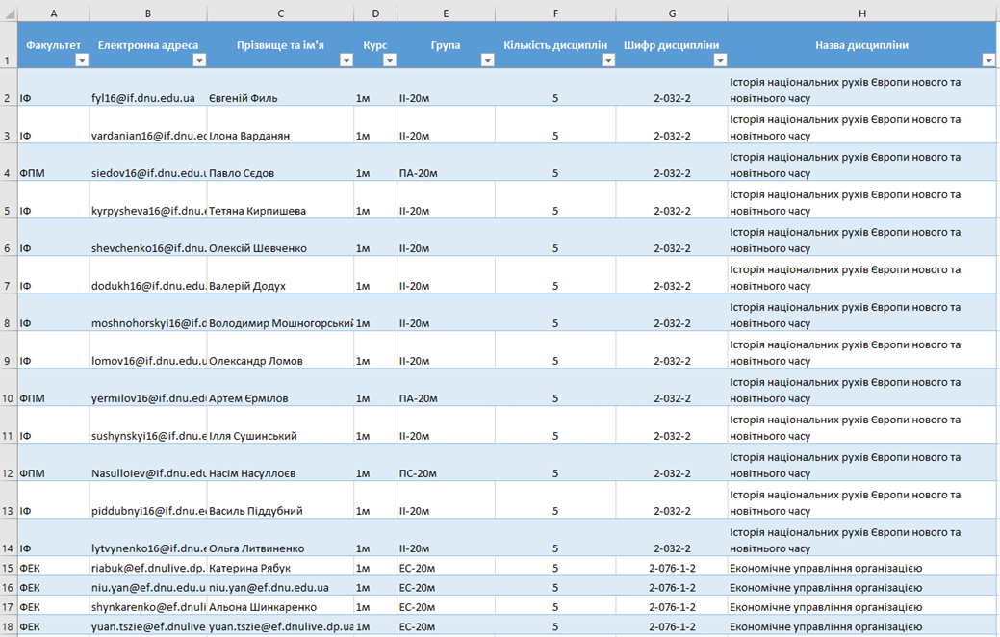
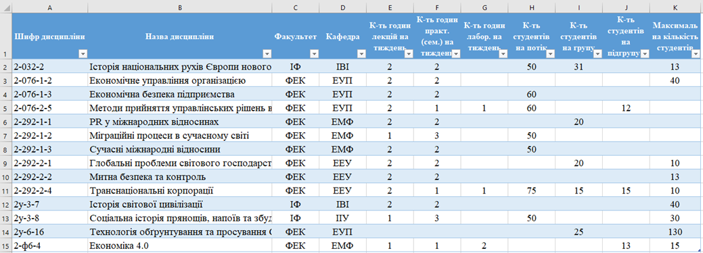
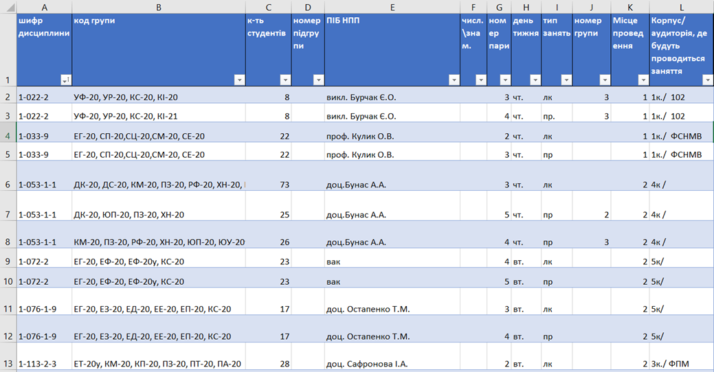
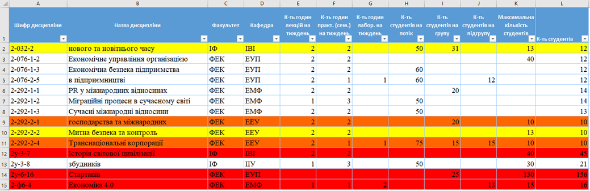
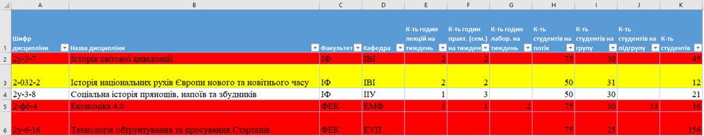

# Discipline Selection Automation
## Console application to work with Excel files and generate different schedules

This console application actively uses by the employees of the Dnipro Oles Honchar National University.
So that it's perfectly tested in the production with the real data and scenarious.

### Incoming data
> The order of the incoming Excel columns should be **exactly the same** as on the examples below

1. **The first incoming Excel file should contain 2 lists**:

    1. The first Excel sheet with the table of students. Each row must contain next columns: 
       - faculty; 
       * student's email; 
       * student's name;
       * student's course; 
       * student's study group; 
       * number of disciplines, that were chosen by this student; 
       * the code of the chosen discipline; 
       + the name of the chosen discipline.

   2. The second Excel sheet with the discipline common data, as:
       - Discipline's code (cipher);
       * Discipline's name;
       * Faculty;
       * Cathedra;
       * Number of hours of lecture per week;
       * Number of hours of practical per week;
       * Number of hours of laboratory per week;
       * Max number of students per group (for lectures);
       * Max number of students per sub-group (for practical and laboratory lessons);
       + Max number of students who can choose this discipline. 

2. **The second Excel file should contain only 1 list with the discipline schedule.** _(It's possible to pass multiple files with the schedule in this application)_. The schedule columns:
   - Discipline's code (cipher);
   * Study groups' codes (should be separated by coma); 
   * Max number of students for this lesson;
   * The number ot sub-group (only for practical and laboratory lessons);
   * Teacher's name;
   * Week type: numerator, denominator, empty (every week);
   * Lesson number;
   * Week day;
   * Lesson's type: lecture, practice, laboratory;
   * Study group's number;
   * Place of lesson's code;
   + Place of lesson.

### Result Sheets in the first Existed File
1. **The First incoming File & The Second existed Page**

Added and filled a new column (number of students who's been chosen the current discipline).

Colored the rows: 

* If the current number of students is greater than the maximum allowed, then this line should be highlighted in red;
* If the current number of students is equal to the maximum allowed, then orange;
* If the stream number is less than the maximum by no more than twenty-five percent, then it is yellow.

2. **The First incoming File and & The new 3d Page**

Created a new Excel Sheet with the same structure as in the 2nd Sheet.

The difference that this new sheet contains only those discipline, that was chosen by the students from the different faculyies.
Also contains a column with number of students who's been chosen the current discipline.

